# Analysis of google trends data
Alexander W. Gofton

- [Load data](#load-data)
- [Average data](#average-data)

``` r
library(tidyverse)
library(patchwork)
```

``` r
# Set file directory and date
home_dir <- "/Users/gof005/Library/CloudStorage/OneDrive-CSIRO/OneDrive - Docs/01_Projects/alpha_gal/aGal_infoepi"

files_dir <- paste0(home_dir, "/data/")

# Define search terms
search_terms <- c(
  "alpha_gal",
  "alpha-gal_syndrome",
  "food_allergy",
  "mammalian_meat_allergy",
  "paralysis_tick",
  "red_meat_allergy",
  "tick_allergy"
)
```

# Load data

``` r
source(paste0(home_dir, "/code/combine_daily_data_function.R"))

# Create a list to store data frames
trend_data <- list()

combine_daily_data("2026-02-13")
```

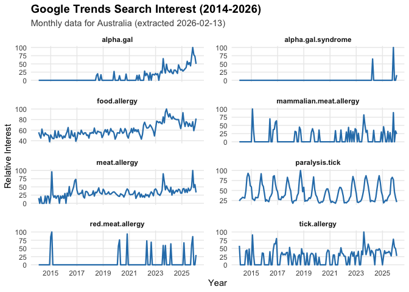

``` r
combine_daily_data("2026-02-14")
```

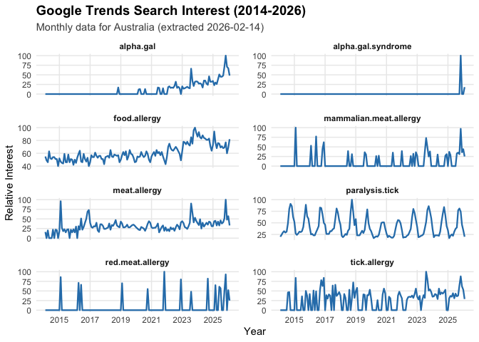

``` r
combine_daily_data("2026-02-15")
```

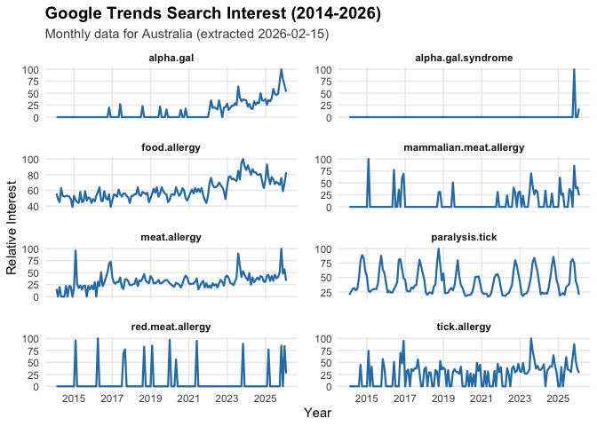

``` r
combine_daily_data("2026-02-16")
```

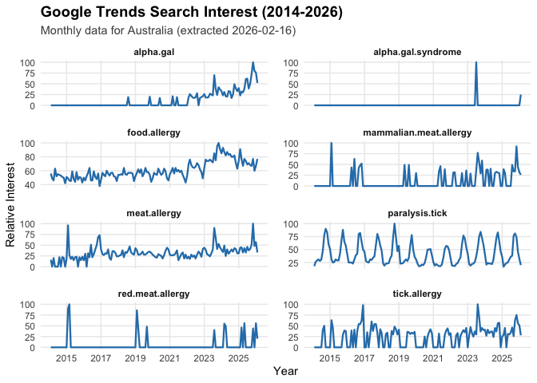

``` r
combine_daily_data("2026-02-17")
```

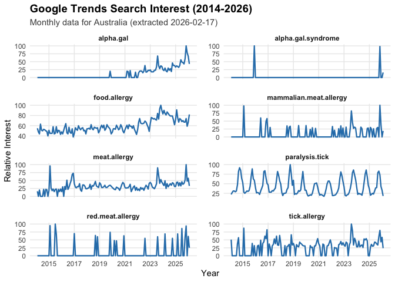

``` r
combine_daily_data("2026-02-18")
```

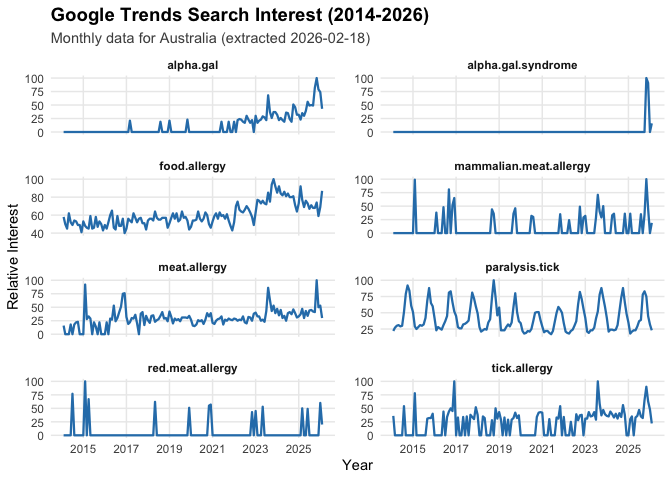

``` r
combine_daily_data("2026-02-19")
```

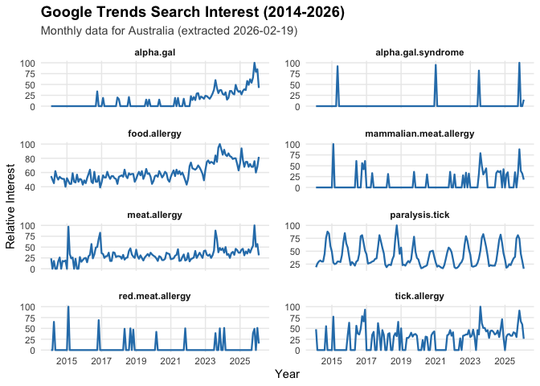

``` r
combine_daily_data("2026-02-20")
```

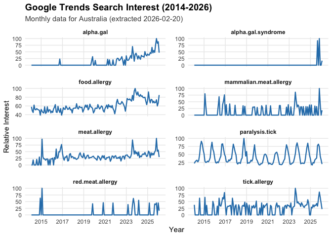

``` r
combine_daily_data("2026-02-21")
```

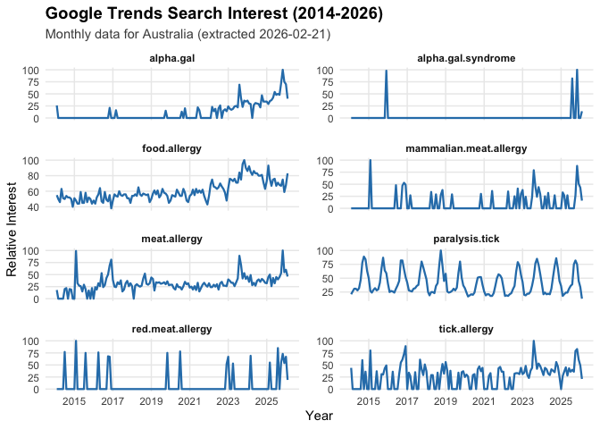

``` r
combine_daily_data("2026-02-22")
```

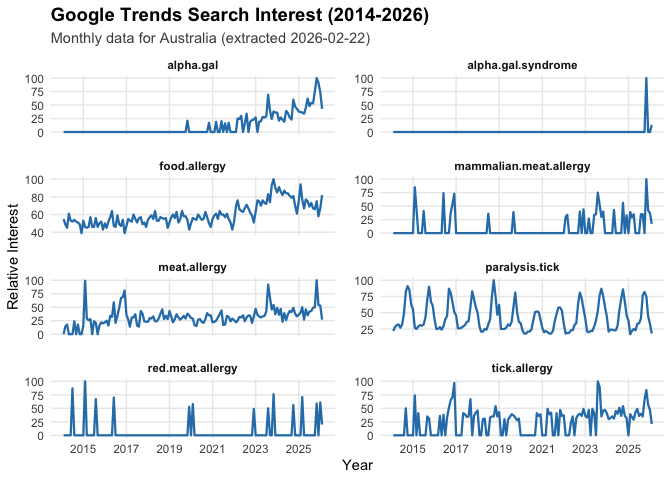

``` r
combine_daily_data("2026-02-23")
```

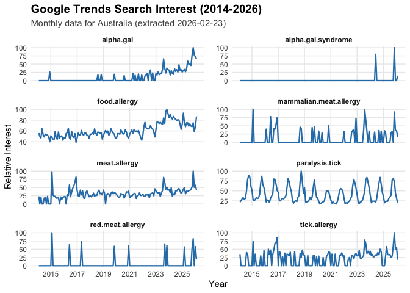

``` r
combine_daily_data("2026-02-24")
```


``` r
combine_daily_data("2026-02-25")
```

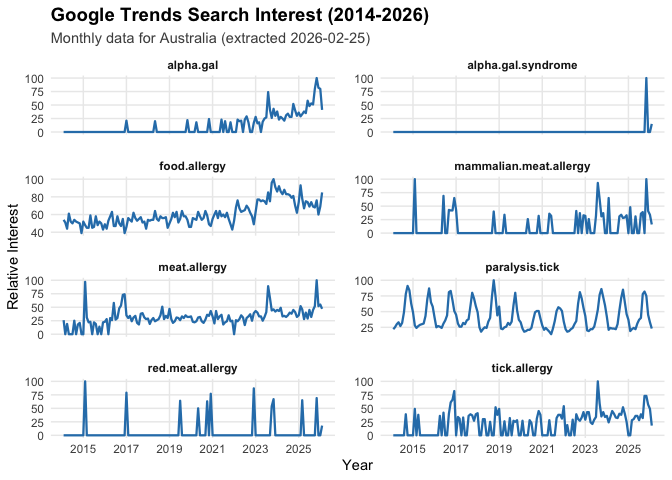

``` r
#combine_daily_data("2026-02-26")
```

    Loaded: alpha_gal 
    Loaded: alpha-gal_syndrome 
    Loaded: food_allergy 
    Loaded: mammalian_meat_allergy 
    Loaded: paralysis_tick 
    Loaded: red_meat_allergy 
    Loaded: meat_allergy 
    Loaded: tick_allergy 
    Plot saved to: /Users/gof005/Library/CloudStorage/OneDrive-CSIRO/OneDrive - Docs/01_Projects/alpha_gal/aGal_infoepi/figures//google_trends_2026-02-13.png 
    Loaded: alpha_gal 
    Loaded: alpha-gal_syndrome 
    Loaded: food_allergy 
    Loaded: mammalian_meat_allergy 
    Loaded: paralysis_tick 
    Loaded: red_meat_allergy 
    Loaded: meat_allergy 
    Loaded: tick_allergy 
    Plot saved to: /Users/gof005/Library/CloudStorage/OneDrive-CSIRO/OneDrive - Docs/01_Projects/alpha_gal/aGal_infoepi/figures//google_trends_2026-02-14.png 
    Loaded: alpha_gal 
    Loaded: alpha-gal_syndrome 
    Loaded: food_allergy 
    Loaded: mammalian_meat_allergy 
    Loaded: paralysis_tick 
    Loaded: red_meat_allergy 
    Loaded: meat_allergy 
    Loaded: tick_allergy 
    Plot saved to: /Users/gof005/Library/CloudStorage/OneDrive-CSIRO/OneDrive - Docs/01_Projects/alpha_gal/aGal_infoepi/figures//google_trends_2026-02-15.png 
    Loaded: alpha_gal 
    Loaded: alpha-gal_syndrome 
    Loaded: food_allergy 
    Loaded: mammalian_meat_allergy 
    Loaded: paralysis_tick 
    Loaded: red_meat_allergy 
    Loaded: meat_allergy 
    Loaded: tick_allergy 
    Plot saved to: /Users/gof005/Library/CloudStorage/OneDrive-CSIRO/OneDrive - Docs/01_Projects/alpha_gal/aGal_infoepi/figures//google_trends_2026-02-16.png 
    Loaded: alpha_gal 
    Loaded: alpha-gal_syndrome 
    Loaded: food_allergy 
    Loaded: mammalian_meat_allergy 
    Loaded: paralysis_tick 
    Loaded: red_meat_allergy 
    Loaded: meat_allergy 
    Loaded: tick_allergy 
    Plot saved to: /Users/gof005/Library/CloudStorage/OneDrive-CSIRO/OneDrive - Docs/01_Projects/alpha_gal/aGal_infoepi/figures//google_trends_2026-02-17.png 
    Loaded: alpha_gal 
    Loaded: alpha-gal_syndrome 
    Loaded: food_allergy 
    Loaded: mammalian_meat_allergy 
    Loaded: paralysis_tick 
    Loaded: red_meat_allergy 
    Loaded: meat_allergy 
    Loaded: tick_allergy 
    Plot saved to: /Users/gof005/Library/CloudStorage/OneDrive-CSIRO/OneDrive - Docs/01_Projects/alpha_gal/aGal_infoepi/figures//google_trends_2026-02-18.png 
    Loaded: alpha_gal 
    Loaded: alpha-gal_syndrome 
    Loaded: food_allergy 
    Loaded: mammalian_meat_allergy 
    Loaded: paralysis_tick 
    Loaded: red_meat_allergy 
    Loaded: meat_allergy 
    Loaded: tick_allergy 
    Plot saved to: /Users/gof005/Library/CloudStorage/OneDrive-CSIRO/OneDrive - Docs/01_Projects/alpha_gal/aGal_infoepi/figures//google_trends_2026-02-19.png 
    Loaded: alpha_gal 
    Loaded: alpha-gal_syndrome 
    Loaded: food_allergy 
    Loaded: mammalian_meat_allergy 
    Loaded: paralysis_tick 
    Loaded: red_meat_allergy 
    Loaded: meat_allergy 
    Loaded: tick_allergy 
    Plot saved to: /Users/gof005/Library/CloudStorage/OneDrive-CSIRO/OneDrive - Docs/01_Projects/alpha_gal/aGal_infoepi/figures//google_trends_2026-02-20.png 
    Loaded: alpha_gal 
    Loaded: alpha-gal_syndrome 
    Loaded: food_allergy 
    Loaded: mammalian_meat_allergy 
    Loaded: paralysis_tick 
    Loaded: red_meat_allergy 
    Loaded: meat_allergy 
    Loaded: tick_allergy 
    Plot saved to: /Users/gof005/Library/CloudStorage/OneDrive-CSIRO/OneDrive - Docs/01_Projects/alpha_gal/aGal_infoepi/figures//google_trends_2026-02-21.png 
    Loaded: alpha_gal 
    Loaded: alpha-gal_syndrome 
    Loaded: food_allergy 
    Loaded: mammalian_meat_allergy 
    Loaded: paralysis_tick 
    Loaded: red_meat_allergy 
    Loaded: meat_allergy 
    Loaded: tick_allergy 
    Plot saved to: /Users/gof005/Library/CloudStorage/OneDrive-CSIRO/OneDrive - Docs/01_Projects/alpha_gal/aGal_infoepi/figures//google_trends_2026-02-22.png 
    Loaded: alpha_gal 
    Loaded: alpha-gal_syndrome 
    Loaded: food_allergy 
    Loaded: mammalian_meat_allergy 
    Loaded: paralysis_tick 
    Loaded: red_meat_allergy 
    Loaded: meat_allergy 
    Loaded: tick_allergy 
    Plot saved to: /Users/gof005/Library/CloudStorage/OneDrive-CSIRO/OneDrive - Docs/01_Projects/alpha_gal/aGal_infoepi/figures//google_trends_2026-02-23.png 
    Loaded: alpha_gal 
    Loaded: alpha-gal_syndrome 
    Loaded: food_allergy 
    Loaded: mammalian_meat_allergy 
    Loaded: paralysis_tick 
    Loaded: red_meat_allergy 
    Loaded: meat_allergy 
    Loaded: tick_allergy 
    Plot saved to: /Users/gof005/Library/CloudStorage/OneDrive-CSIRO/OneDrive - Docs/01_Projects/alpha_gal/aGal_infoepi/figures//google_trends_2026-02-24.png 
    Loaded: alpha_gal 
    Loaded: alpha-gal_syndrome 
    Loaded: food_allergy 
    Loaded: mammalian_meat_allergy 
    Loaded: paralysis_tick 
    Loaded: red_meat_allergy 
    Loaded: meat_allergy 
    Loaded: tick_allergy 
    Plot saved to: /Users/gof005/Library/CloudStorage/OneDrive-CSIRO/OneDrive - Docs/01_Projects/alpha_gal/aGal_infoepi/figures//google_trends_2026-02-25.png 

# Average data

``` r
source(paste0(home_dir, "/code/average_daily_data_function.R"))

# For just the dates you already have processed
date_list <- c("2026-02-13", "2026-02-14", "2026-02-15", "2026-02-16")
results <- plot_average_trends(date_list)

tail(results$summary_stats)
```

    Processed data from: 2026-02-13 
    Processed data from: 2026-02-14 
    Processed data from: 2026-02-15 
    Processed data from: 2026-02-16 
    Plot saved to: /Users/gof005/Library/CloudStorage/OneDrive-CSIRO/OneDrive - Docs/01_Projects/alpha_gal/aGal_infoepi/figures/google_trends_average_2026-02-13_to_2026-02-16.png 
    # A tibble: 6 × 8
      date       search_term mean_interest sd_interest se_interest lower_ci upper_ci
      <date>     <chr>               <dbl>       <dbl>       <dbl>    <dbl>    <dbl>
    1 2026-02-01 food.aller…          81         2.71        1.35      78.3     83.7
    2 2026-02-01 mammalian.…          24.8       0.957       0.479     23.8     25.7
    3 2026-02-01 meat.aller…          33         0           0         33       33  
    4 2026-02-01 paralysis.…          20.2       0.5         0.25      19.8     20.7
    5 2026-02-01 red.meat.a…          25.5       4.20        2.10      21.4     29.6
    6 2026-02-01 tick.aller…          28         0.816       0.408     27.2     28.8
    # ℹ 1 more variable: n_obs <int>

``` r
# View the plot
results$plot
```

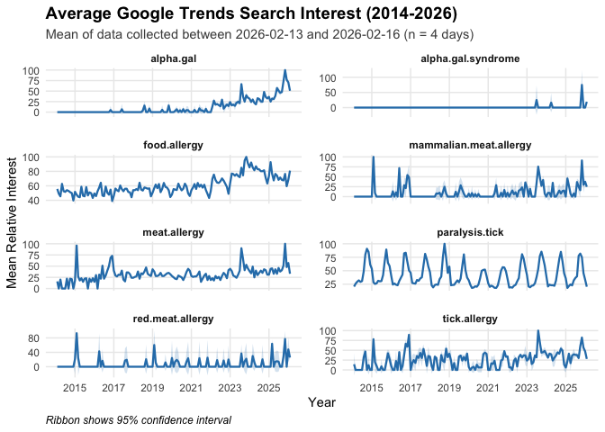
